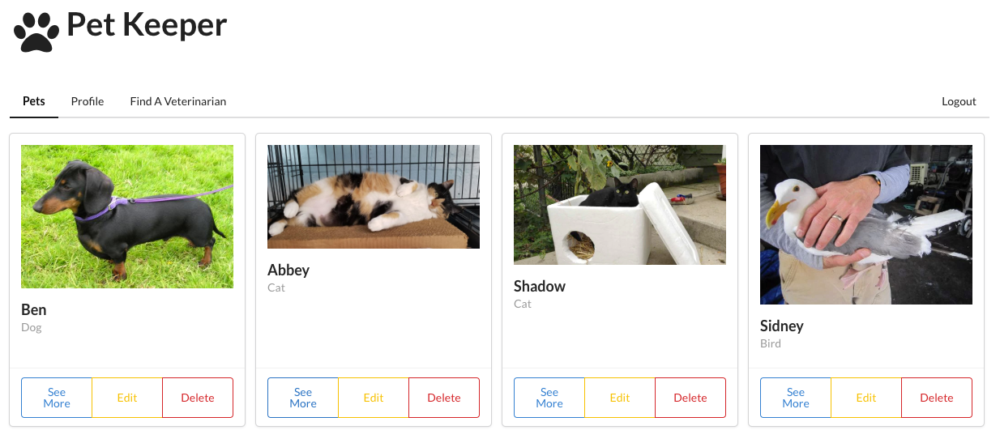

# Welcome to Pet Keeper

Rails API backend of Pet Keeper, a place to store data about your pets!

## Demo


[Vimeo demo](https://vimeo.com/348980761)

## Installation
* If you would like to use this repo locally, please download the frontend, which you can find [here](https://github.com/Mera-Stackhouse/pet-keeper-frontend)
* Download [PostgreSQL](https://www.postgresql.org/) database
* Clone down this repo
* From the main folder in the terminal, run ```bundle install```
* Database creation
  * ```rails db:create```
  * ```rails db:migrate```
* Database initialization
  * A seed file is included with optional users and pets
  * There are examples of how to create users and pets
  * ```rails db:seed```
* Start the server with ```rails s```
* Make sure your frontend refers to the correct port for fetching.

## Features of Pet Keeper
* Log in to password protected account (see seed data for already created user log in info)
* View and edit your profile.
* Add, edit, and remove your pets.

## Technologies
* JWT for user authentication

## License

* Under the [MIT License](docs/LICENSE.md)
